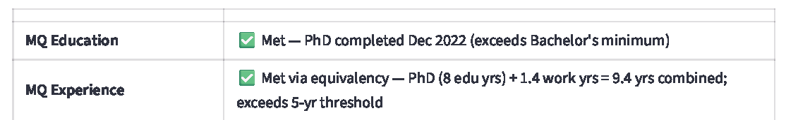

# UA MQ-RE Helper

U of A Minimum Qualifications and Relevant Experience Helper.

> [!NOTE]
> No sensitive, restricted, or production HR data is included in this repository.

## Overview

This repository contains a prototype Streamlit application that supports structured review of candidate minimum qualifications and relevant experience against a University job description.

The tool is designed as a decision-support aid for human reviewers. It is not a hiring decision engine and does not replace HR judgment, policy review, or required institutional processes.

## Current status

This project is an early pilot/prototype.

Current capabilities include:
- Uploading a candidate or incumbent resume.
- Uploading a University job description.
- Sending extracted text to an approved LLM endpoint.
- Returning a structured 5-section review format for HR analysis.

## Screenshots

The screenshots below show the prototype interface only. All examples use redacted, synthetic, or otherwise approved non-sensitive content.

### Prototype interface


### Example structured output




### Notes on screenshots

- Store screenshots in a folder such as `images/` or `assets/` and reference them with relative paths in Markdown.
- Do not upload screenshots containing API keys, personal data, applicant names, employee IDs, or restricted HR information.
- Redact all sensitive or identifying details before committing images to the repository.

## Purpose

The goal of this pilot is to explore whether AI can help HR reviewers:
- Save time on first-pass structured review.
- Apply consistent formatting across MQ and relevant experience summaries.
- Surface possible gaps, assumptions, and follow-up questions for human review.

## Important limitations

- Human review is always required.
- Output may be incomplete, incorrect, or based on imperfect document text extraction.
- File parsing quality can vary by format and source document.
- Results should not be treated as the final qualification determination.
- This repository does not include confidential production data, API keys, or internal records.

## Privacy and data handling

Do not commit or upload any of the following to this public repository:
- API keys.
- `.env` files or secrets files.
- Resumes, job descriptions, or output files containing sensitive or restricted data.
- Screenshots that expose personal information or internal-only content.

Before sharing examples publicly:
- Remove names and identifying details.
- Remove employee or applicant data.
- Remove any sensitive institutional information.
- Confirm sharing is appropriate under applicable University guidance.

## Tech stack

- Python
- Streamlit
- AI-Verde API
- Claude Sonnet 4.6 (or other approved model, depending on access)

## Repository contents

Example contents may include:
- Streamlit app code
- Prompt templates
- Documentation
- Screenshots with redacted data
- Sample configuration guidance

This public repository is intended to share the project structure and approach only. Sensitive testing materials should remain in a private workspace.

## Local setup

### 1. Clone the repository

```bash
git clone https://github.com/ginajones123/UA-MQ-RE-Helper.git
cd UA-MQ-RE-Helper
```

### 2. Create a virtual environment

```bash
python -m venv .venv
```

### 3. Activate the virtual environment

#### Windows

```bash
.venv\Scripts\activate
```

#### macOS / Linux

```bash
source .venv/bin/activate
```

### 4. Install dependencies

```bash
pip install -r requirements.txt
```

### 5. Configure environment variables

Create a local environment file or otherwise set the required variables outside version control.

Example:

```env
AI_VERDE_API_KEY=your-key-here
```

Never commit secrets to GitHub.

### 6. Run the app

```bash
streamlit run MQ-RE_api_AI-VERDE.py
```

## Example workflow

1. Start the Streamlit app locally.
2. Upload a resume.
3. Upload a job description.
4. Run the review.
5. Inspect the structured output.
6. Confirm all conclusions through human review.

## Intended use

Appropriate uses:
- Prototype development
- Capstone demonstration
- Internal concept discussion
- Workflow exploration
- Prompt and extraction testing

Not appropriate as-is for:
- Fully automated qualification decisions
- Unreviewed employment actions
- Public-facing applicant screening
- Production use without review, security, privacy, and policy approval

## Future development

Potential next steps:
- Improved document extraction and validation
- Better logging and error handling
- Pilot deployment in an approved environment
- Authenticated access for internal users
- Usage monitoring and token tracking
- HR reviewer feedback loop
- Preliminary salary range support based on posted education and experience requirements, with required HR review, internal equity review, and role-specific adjustment before any use in decision-making

## Disclaimer

This tool is for decision-support only. Final minimum qualifications and relevant experience determinations must be made by an authorized human reviewer using applicable policy, guidance, and professional judgment.

## License

This project is licensed under the MIT License unless otherwise noted.

## Contact

For questions about this repository, contact the repository owner through GitHub.
